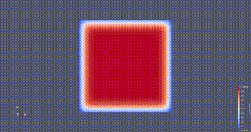

# Benchmarking Julia on the 2d heat equation

This project benchmarks different implementations of the transient 2d heat equation in Julia on CPU and GPU against Numpy, Pytorch, and a reference implementation in C++.

## Numerical scheme

We compute the 2d heat equation using the explicit Euler method:

$$
\frac{\partial u}{\partial t} = \nabla^2 u\\
u(x, y, 0) = 1\\
u(x, y, t) = 0 \quad \text{for} \quad x = 0, x = 1, y = 0, y = 1
$$

where $u$ is the temperature field.

The discretization is described in a config file of the following form:

```yaml
discretization:
  N: 100
  dt: 0.01
t_end: 3.0
write_every: 10
```

The discretization works using the following scheme:
$$
  u_{i,j}^n \approx u(x_i, y_j, t_n) \\
  x_i = i \cdot h \\
  y_j = j \cdot h \\
  t_n = n \cdot \Delta t \\
  h = \frac{1}{N-1} \\
  u_{i,j}^{n+1}= u_{i,j}^n + \frac{\Delta t}{h^2} \cdot (u_{i+1,j}^n + u_{i-1,j}^n + u_{i,j+1}^n + u_{i,j-1}^n\\
  \quad - 4 \cdot u_{i,j}^n) \\
  u_{i,j}^0 = 1 \\
  u_{i,j}^n = 0 \quad \text{for} \quad i = 0, i = N, j = 0, j = N
$$

$N$ is the number of grid points in each direction including ghost cells. Therefore, the grid size is $1/(N-1)$.

The solver will compute the discretization every `write_every` steps and write the result to a file called `output/{step}.vti` with a field called `temperature`. You can visualize the output by opening `output/solution.pvd` in Paraview:



## Installation

The scripts of the project only work on unix systems. On Windows, use wsl2, or run the programs manually.

To install the project, clone the repository. Install python3 and pip3, and a C++ compiler with cmake. Install julia. Create a venv:

```bash
python3 -m venv env
```

Activate the venv:

```bash
source env/bin/activate
```

Or on fish:

```bash
. env/bin/activate.fish
```

Now install all the dependencies:

```bash
./install.sh
```

If you do not have the hardware for a specific implementation, the install script may fail for that implementation, you can ignore the error.

## Running an implementation

To run an implementation, cd into the implementation directory and run the `run.sh` script with the config file as argument:

```bash
cd implementations/my_implementation
./run.sh ../../config.yaml
```

This example will run `my_implementation` with the config file `config.yaml` in the main directory.

The parameter `write_every` specifies that the output should be written if `iteration % write_every == 0`. If `write_every==-1`, the output will never be written.

## Benchmarking

Further, each implementation has a benchmarking script that works similar to the `run.sh` script. It will run the implementation with the config file and measure the runtime. The benchmarking script is called `benchmark.sh`. Example usage:

```bash
cd implementations/my_implementation
./benchmark.sh ../../config.yaml
```

This will output a file called `benchmark_results.yaml` in the implementation directory with the runtime of the implementation. The format of the file is:

```yaml
time_unit: "s"
time:
  median: 0.457654083
  max: 0.494241333
  min: 0.451452
  mean: 0.4642664014545455
  std: 0.014040064580616386
memory: 23552456
```

The scrip `benchmark.sh` in the root directory will benchmark all implementations with all configurations in the `benchmark_configs` folder and write the results to `benchmark_results.yaml`.

## Testing

Run the tests with the following command:

```bash
./test.sh
```

This will run each implementation and compare the output to our reference implementation.
